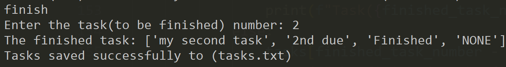

# (و ما توفيقى إلا بالله)
# 🧠 To-Do List App using Python 

To-Do List CLI Application is a powerful task manager built with **Python**. It allows users to create, edit, organize, and track their daily tasks directly from the command line.         

The application supports essential task management features such as adding deadlines, attaching notes, marking tasks as finished or unfinished, searching tasks, and saving progress into a local file `tasks.txt` for presistance. 

## 📚 Table of Contents (TOC)

- [Folder Structure](#folder-structure)
- [App Features](#app-features)
- [CLI Screenshots](#cli-screenshots)
- [App Installation](#app-installation)
- [Future Work](#future-work)
- [Author](#author)
- [LICENSE](#license)
- [Contributing](#contributing)
- [NOTEs](#notes)

---         

## 📁 Folder Structure

``` bash
To-Do_List/
├── Docs/       # *.png snippets for app test
├── todo.py     # Python Source Code for the App
├── README.md   # Overview for the project
├── LICENSE     # MIT LICENSE for copy rights
└── .gitignore  # Protect the repo from unwanted files or directories
```
---         

## 🚀 App Features

- ➕ Add a new task with a name, due date, and optional NOTE.       
- 📝 Edit existing tasks (update name, due date, or NOTE).
- ✅ Mark tasks as **finished** or 🔄 **unfinished**.
- ❌ Delete a task by its number in your task list. (heighest priority : number (1))
- 👀 Show all tasks. Seperate **Finished** & **Not Finished** for clarity.
- 🔍 Search tasks by keyword in task (Name, Due Date, Status, or NOTE).
- 🔢 Show a specific task by its number in your task list.
- 🔀 Swap two tasks to reorder them (Custom Priority).
- 💾 Save tasks into a local file `tasks.txt`.
- 📂 Load tasks from the local file `tasks.txt`.
- 🗑 Reset all tasks from (task list, tasks.txt) to start fresh.

---         

## 📸 CLI Screenshots

This section shows a real world test scenarios to verify functionality of the application.   

### Main Menue
Just after `python todo.py`, this menue appears to choose operation: 


### ➕ Add a New Task
Write `add` to add a new task. 


### 👀 Show All Tasks
After adding 3 tasks, write `show` to display the task list:


### 📝 Edit an Existing Task
Write `edit` to edit an existing task (e.g., task(1)):


### ✅ Mark an Existing Task as Finished
Write `finish` to mark an existing task as finished task.
- Finish Task(1): 

- Finish Task(2): 


This is the task list after mark Task(1) & Task(2) as Finished:


### Mark an Existing Task as Unfinished
Write `unfinish` to mark a Finished task as Not Finished: 


### 👀 Show All Tasks
Write `show` to display the task list after mark Task(2) as Not Finished:


### 🔍 Search for Tasks
Write `search` to search for tasks with an existing keyword: 


If we add a keyword which isn't existing in the task list, this will be the O/P:


### 🔀 Swap 2 Tasks
Write `swap` to swap 2 tasks (custom priority): 


This is the task list after swap to change priority: 


### 🗑 Reset Task List
Write `rst` to reset all tasks and empty `tasks.txt`: 


This is the task list after rst: it's empty


---         

## 📥 App Installation

**Follow these instructions** 

1. Open your terminal. 
2. Write these lines in the terminal: 
```bash
git clone https://github.com/kareem05-ash/To-Do_List.git
cd To-Do_List
touch tasks.txt
```
3. If you don't have a **Python** backage in your PC, install it from [Link](https://www.python.org/downloads/)
4. Open your terminal again. Change directory to project directory `\To-Do_List`
5. Write this line in the terminal: 
```bash
python todo.py
```
6. Congratulations! Now, you see *Hello, World!*.

---     

## 🔮 Future Work

- 🎨 Add a simple GUI interface (Tkinter / PyQt) instead of CLI. 
- ☁ Support saving & loading from a database or cloud storage.
- 📱 Build a mobile version for the app.
- ⏰ Add reminder / notification for upcoming tasks.
- 🏷 Support categories or tags for tasks (e.g., Work, Personal, Urgent).
- 📊 Add statistics (e.g., % completed tasks, weekly progress). 
- 🌍 Add multi-language support. 
- 🔒 Add user authentication (mluti-user support).

---     

## 👨‍💻 Author

- 📧 **E-Mail**: (kareem.ash05@gmail.com)      
- 🔗 **Linkedin**: [Kareem Ashraf](www.linkedin.com/in/kareem-ashraf-9aba48348)       
- 🔗 **GitHub**: (https://github.com/kareem05-ash)
- 🔗 **Phone Number**: +201002321067 / +201154398353       

---  

## ⚖ LICENSE

**MIT LICENSE** for copy rights: [LICENSE](./LICENSE)

---         

## 🤝 Contributing

Contributions are welcome! Please feel free to submit a **Pull Request** or create an **Issue**. For major changes, please open an issue first.

---     

## 📌 NOTEs

This project is part of my **Self-Learning Journey**. I keep enhancing it by adding new features and fix bugs if exist.

---     